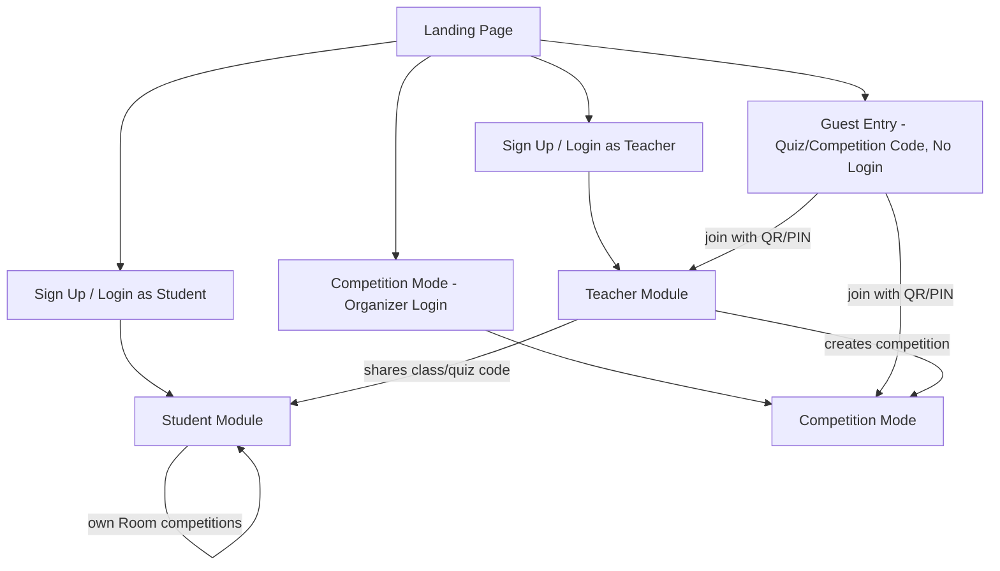
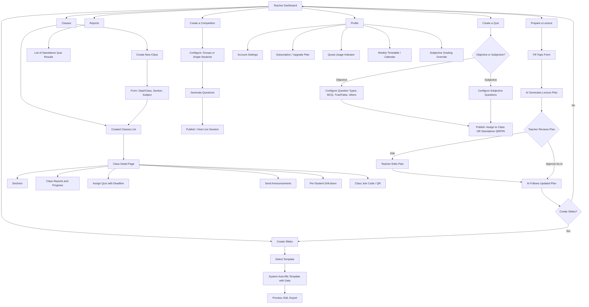
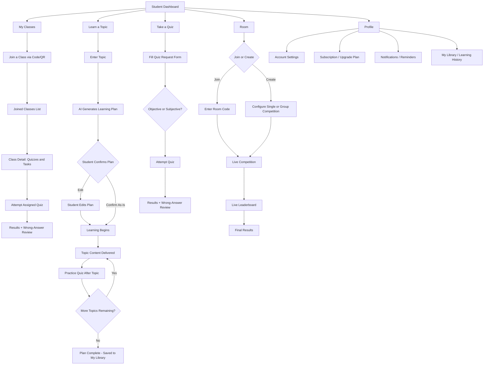
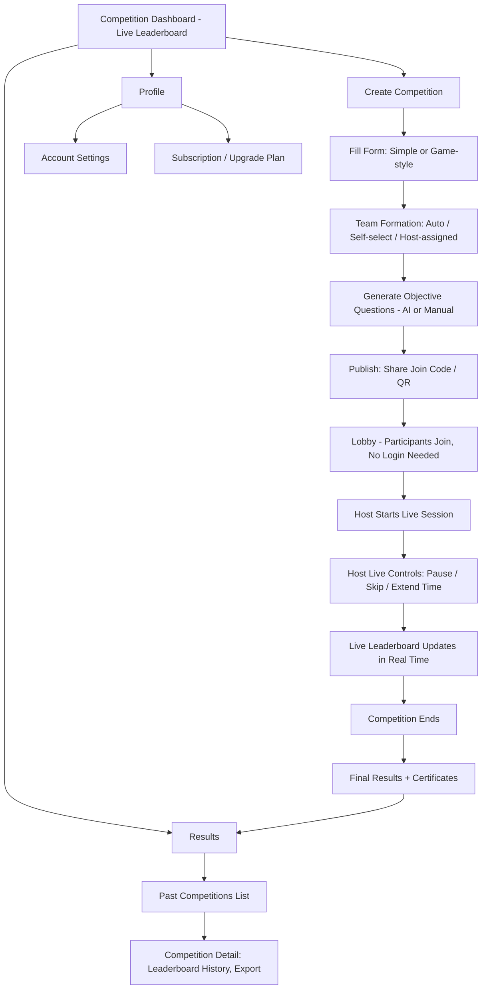
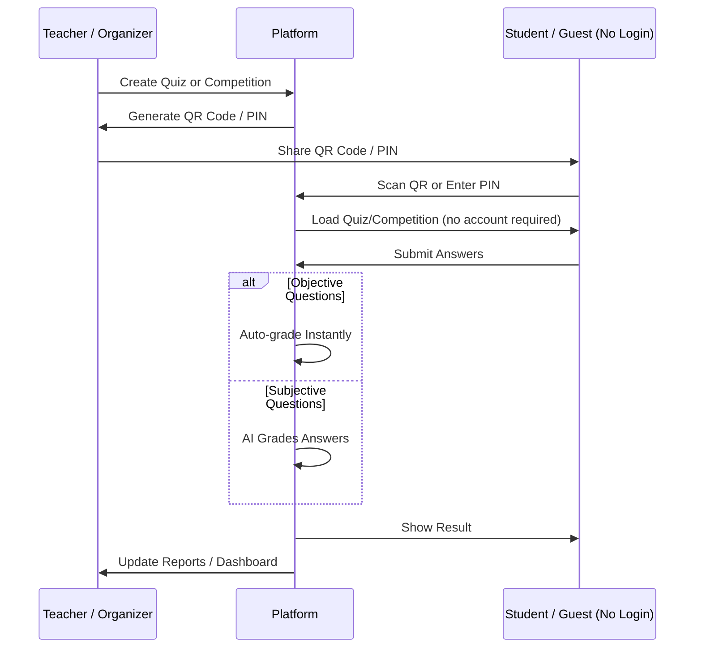

# Prototype Specification — Complete System Flow
### For building a prototype that matches the approved idea exactly, without deviation

**How to use this document:** Section 2 gives the high-level picture. Sections 3–5 each contain a navigation flow diagram (follow it exactly), a screen-by-screen table (build every row — nothing extra, nothing missing), and callouts for approved additions. Section 6 covers the flow that connects all three modules. Section 7 is a non-negotiable checklist — check every box before presenting the prototype.

*(Diagrams are written in Mermaid syntax. They render natively on GitHub, GitLab, Obsidian, Notion, VS Code with the Mermaid extension, and most modern Markdown viewers.)*

---

## 1. Scope

This prototype covers three independent modules:
1. **Teacher Module**
2. **Student Module**
3. **Competition Mode** (standalone)

No database schema is included here — this document is purely the functional/navigational flow.

---

## 2. High-Level System Flow

**Key principle:** Teacher and Student modules are fully independent. A teacher never directly accesses a student's account, and a student can use the entire platform (self-learning + quizzes + Room) without ever being added to a teacher's class.

---

## 3. Teacher Module

### 3.1 Navigation Flow

### 3.2 Screen Specification

| # | Screen | Purpose | Key Elements | Navigates To |
|---|---|---|---|---|
| 1 | Dashboard | Consolidated overview | Recent classes, recent quizzes, quota usage widget, notifications | All other teacher screens |
| 2 | Prepare a Lecture | Get an AI lecture plan | Topic form → AI plan viewer/editor → "Create Slides?" prompt | Create Slides (optional) |
| 3 | Classes → Create New Class | Start a new class | Form: department/class, section, subject | Created Classes list |
| 4 | Classes → Created Classes | Manage existing classes | List of classes, each opens to detail | Class Detail |
| 5 | Class Detail | Manage one class | Sections, reports/progress, assign quiz, announcements, per-student drill-down, join code/QR | Assign Quiz flow |
| 6 | Reports | View standalone (non-class) quiz results | List of quizzes taken outside any class, with scores/analytics | — |
| 7 | Create a Competition | Launch a gamified quiz | Group/single config, question generation, publish/host | Live hosting screen |
| 8 | Create Slides | Build slides from a template | Template picker, auto-filled content, preview/edit/export | — |
| 9 | Create a Quiz | Direct quiz creation | Objective/subjective toggle, question type config, publish (class or QR/PIN) | Class Detail (if assigned) or standalone link |
| 10 | Profile | Account and plan management | Settings, subscription/upgrade, quota indicator, weekly timetable, grading override toggle | — |

### 3.3 Approved Additions (must be included)
- Class join code/QR generation
- Assign quiz to class with a deadline
- Subjective grading override (teacher can edit AI-assigned grades before finalizing)
- Announcements to a class
- Weekly timetable/calendar
- Per-student drill-down within class reports
- Subscription/upgrade screen + quota usage indicator

### 3.4 Explicitly Excluded
- Question bank/library (declined — do not build)

---

## 4. Student Module

### 4.1 Navigation Flow

### 4.2 Screen Specification

| # | Screen | Purpose | Key Elements | Navigates To |
|---|---|---|---|---|
| 1 | Dashboard | Summarized overview | Joined classes snapshot, recent activity, quota/notifications | All other student screens |
| 2 | My Classes → Join | Join a teacher's class | Code entry / QR scanner | Joined Classes list |
| 3 | My Classes → List | View joined classes | List of classes, each with pending quizzes/tasks | Class Detail |
| 4 | Class Detail | Attempt class-assigned work | List of quizzes/tasks with deadlines | Quiz attempt screen |
| 5 | Learn a Topic | Self-paced learning | Topic input → AI plan → confirm/edit → topic content → per-topic practice quiz | My Library (on completion) |
| 6 | Take a Quiz | Standalone practice quiz | Form (topic/details), objective/subjective choice, attempt, results | Wrong-answer review |
| 7 | Room | Peer competition | Join or create (single/group), live play, live leaderboard, final results | — |
| 8 | Profile | Account and plan management | Settings, subscription/upgrade, notifications, learning history/library | — |

### 4.3 Approved Additions (must be included)
- Explicit "Join a Class" action (code/QR)
- Wrong-answer review with explanations after any quiz
- My Library / Learning history (revisit past plans without regenerating)
- Notifications/reminders
- Subscription/upgrade screen

---

## 5. Competition Mode (Standalone)

### 5.1 Navigation Flow

### 5.2 Screen Specification

| # | Screen | Purpose | Key Elements | Navigates To |
|---|---|---|---|---|
| 1 | Dashboard | Live overview | Live leaderboard, panel data | Create Competition, Results |
| 2 | Create Competition | Set up a competition | Format config, team formation, question generation, publish/share code | Lobby → Live session |
| 3 | Lobby | Pre-game holding screen | Joined participants list, "Start" button (host only) | Live session |
| 4 | Live Session | Run the competition | Question display, live rank updates, host controls (pause/skip/extend) | Final Results |
| 5 | Results | Post-competition record | Past competitions list, detail view with leaderboard history and export | — |
| 6 | Profile | Account and plan management | Settings, subscription/upgrade | — |

### 5.3 Approved Additions (must be included)
- Join Competition flow (code/QR, no login required for guests)
- Team formation options
- Host live controls (pause/skip/extend time)
- Certificates + custom branding (tied to Premium tier)

---

## 6. Cross-Cutting Flow: No-Login Quiz/Competition Attempt

This is a core differentiator of the platform and must work exactly as shown — it is what allows a student or guest to participate without creating an account.

---

## 7. Non-Negotiable Checklist

Before presenting the prototype, confirm every item below is present and unchanged from the approved idea:

**Teacher**
- [ ] Prepare a Lecture ends with an explicit "Create Slides?" prompt
- [ ] Classes has both "Create New Class" and "Created Classes" as separate, visible options
- [ ] Reports shows only standalone (non-class) quiz results
- [ ] Create a Quiz supports objective (multiple types, not just MCQ/T-F) AND subjective
- [ ] Create Slides uses templates that the system auto-fills
- [ ] Weekly timetable/calendar is present
- [ ] No question bank/library feature has been added

**Student**
- [ ] My Classes is separate from Take a Quiz (class-assigned vs. standalone are distinct flows)
- [ ] Learn a Topic requires student confirmation of the AI plan before learning starts
- [ ] A practice quiz is generated after every topic in a learning plan
- [ ] Room supports both single and group competition
- [ ] Wrong-answer review is present after every quiz

**Competition Mode**
- [ ] Fully standalone from Teacher/Student login (organizer-driven)
- [ ] Live leaderboard is visible on the dashboard
- [ ] Objective question types only (no subjective in this module)
- [ ] Guests can join via code/QR with no login

**Cross-cutting**
- [ ] No-login flow works for both quizzes and competitions
- [ ] Subjective answers are graded by AI, with a teacher override option
- [ ] Subscription/upgrade screen and quota indicators exist in both Teacher and Student profiles

---

*This document is the exact functional blueprint discussed and approved. Building strictly to Sections 3–6, and passing every box in Section 7, ensures the prototype matches the approved idea with no deviation.*
